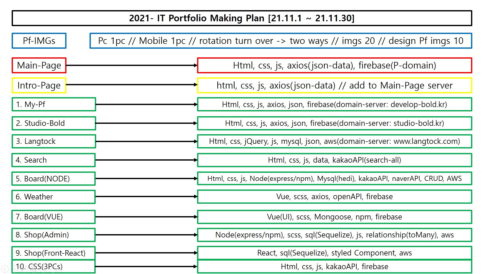
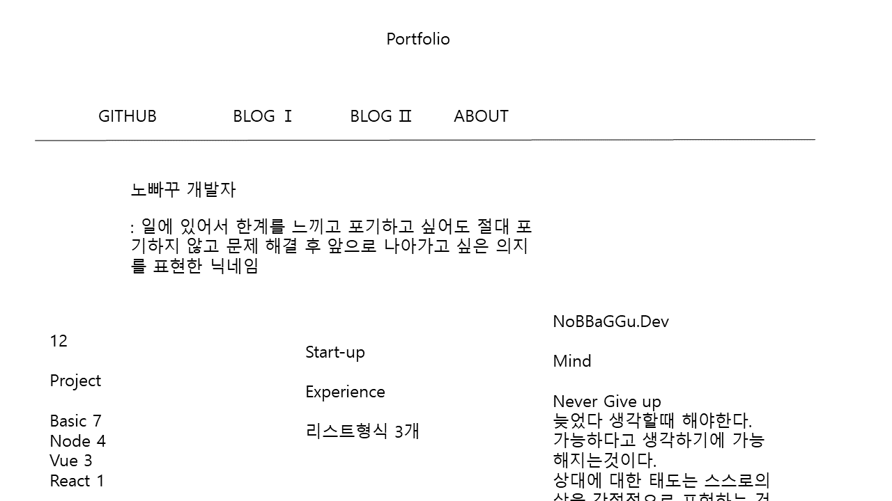

# [PORTFOLIO](https://cutygost.com)

# 1. 프로젝트 개요

## - 자체 프로젝트(1인)

## - 소개용 포트폴리오 사이트 제작

## - 아마추어 느낌의 사이트 지양

## - [아마추어 느낌의 첫 포트폴리오 소개 사이트 확인](https://intropf.web.app/)

---

# 2. 프로젝트 방향

## - simple한 포트폴리오 사이트

## - 관련 기술과 작성자 idea 및 생각을 표현할 수 있도록 제작

## - 각 포트폴리오의 기획내용+산출물 링크 처리로 확인 가능하도록

## - Git 및 기타 개발관련 SNS 링크 연결로 본인을 알림

## - 5개월 교육 과정이 끝나기에 '포트폴리오'를 만들어봄

## - 실제로 어떤 프로젝트를 직접 기획하고 진행한 최초의 내용

---

# 3. 사실적 의견

## - 첫 프로젝트였기에 이것저것 해보고 싶었던게 많았던 프로젝트

## - 먼저 할 수 있는 기능은 직접 연구하며 구현 후 심플하게 고도화 진행

---

# 4. 고도화 방향

## - 통일된 코드

## - 최신 기술 사용

---

# 5. 프로젝트 기획

## 

## 

## 

## 

## 

## 

## 

## 

## 

## 

---

# 6. 프로젝트 결과

# [PORTFOLIO WEBSITE](https://cutygost.com)

---

## 7. 생각

## - 무조건 React를 하고 Node까지 가능한 프론트앤드 개발자!

## - 늦었지만 제대로 할 수 있는 프론트앤드 개발자가 될 것이다! 화이팅 : )
